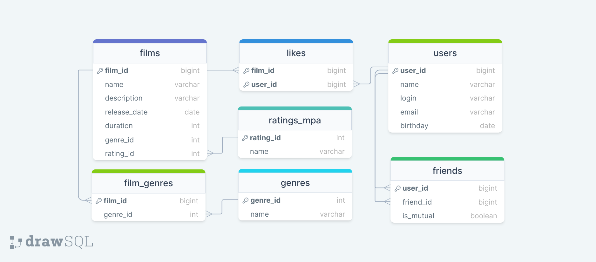

# java-filmorate
Template repository for Filmorate project.


<details>
  <summary>Получить информацию о фильме по id = 1 с названием его рейтинга</summary>

```sql
    SELECT F.*,
           R.NAME
    FROM FILMS F
    INNER JOIN RATING R ON F.RATING_ID = R.RATING_ID
    WHERE FILM_ID = 1;
```

</details>  

<details>
  <summary>Получить информацию о статусе дружбы пользователей</summary>

```sql
    SELECT U.*,
           F.STATUS
    FROM USERS U
    INNER JOIN FRIENDS F ON U.USER_ID = F.USER_ID
    WHERE F.FRIEND_ID = 1;
```

</details>  